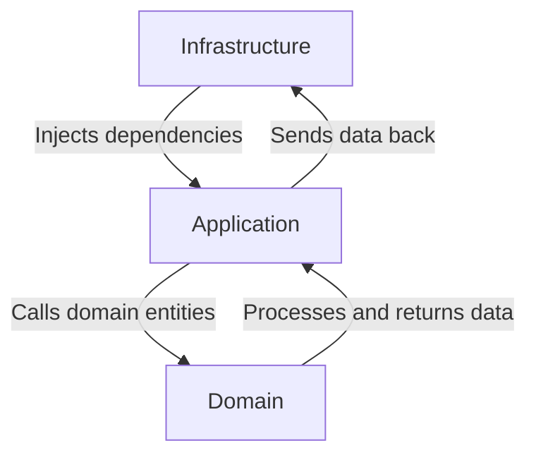

# 🏗 lab-react-clean-architecture

## 📌 Table of Contents

<!-- TOC -->

- [🏗 lab-react-clean-architecture](#-lab-react-clean-architecture)
  - [📌 Table of Contents](#-table-of-contents)
  - [📌 Repository Objective](#-repository-objective)
  - [⚠️ Disclaimer](#-disclaimer)
  - [🎯 Clean Architecture: A Conceptual Framework](#-clean-architecture-a-conceptual-framework)
  - [🏗 Key Principles](#-key-principles)
  - [🛠️ SOLID Principles](#-solid-principles)
  - [🚀 Onion Architecture](#-onion-architecture)
    - [🚀 **Data Flow in Onion Architecture**](#-data-flow-in-onion-architecture)
    - [📊 **Step-by-Step Data Flow Example: Adding a Movie**](#-step-by-step-data-flow-example-adding-a-movie)
    - [🎯 **Key Takeaways**](#-key-takeaways)
  - [🔍 Bounded Contexts & Their Interaction](#-bounded-contexts--their-interaction)
    - [🔄 How Bounded Contexts Interact](#-how-bounded-contexts-interact)
    - [📂 Applying Bounded Contexts with Onion Architecture](#-applying-bounded-contexts-with-onion-architecture)
    - [Example Bounded Context for "Movies":](#example-bounded-context-for-movies)
  - [🛠️ Tech Stack](#-tech-stack)
  - [📂 Code Structure](#-code-structure)
    - [🏗 Organization Based on Clean Architecture](#-organization-based-on-clean-architecture)
  - [🚀 Installation](#-installation)
  - [Contributions & Feedback](#contributions--feedback)
  - [📚 Useful Resources](#-useful-resources)
  - [📝 Quick Summary](#-quick-summary)
  - [License](#license)
  <!-- TOC -->

---

## 📌 Repository Objective

This project is a **technical experiment** aimed at exploring the principles of **Clean Architecture** applied to front-end development with **React**.  
The main goal is to test different approaches to structuring a React application in a **modular and maintainable** way, while minimizing dependencies and improving testability.

Modern front-end applications are increasingly complex, with **rich business logic, shared state, and extensive interactions**. However, they often suffer from:

- **High coupling** between UI and business logic.
- **Difficult testing** (logic is embedded in components).
- **Messy state management** (React hooks spread everywhere).
- **Over-reliance on third-party libraries** (which limits scalability).

By leveraging **Clean Architecture principles**, we aim to create **a scalable front-end structure** with a **clear separation of concerns**.

---

## ⚠️ Disclaimer

This repository is an **ongoing experimental project** exploring the application of **Clean Architecture in React**.  
As this experimentation progresses, **some concepts, implementations, and examples may evolve** based on new insights, practical adjustments, or community feedback.

Feel free to **join the discussion, share ideas, or suggest improvements** as this project continues to refine its approach. 🚀

---

## 🎯 Clean Architecture: A Conceptual Framework

Unlike MVC or Hexagonal Architecture, **Clean Architecture** does not impose a fixed structure.  
It is a **conceptual framework** based on:

- **Separation of concerns** (Domain, Application, Infrastructure).
- **Dependency inversion** (business logic does not depend on external tools).
- **Organizing modules around the core business domain** (_Bounded Contexts_).

One of its key principles is that **dependencies always flow inward**—meaning:
📌 **The UI and APIs depend on business logic, not the other way around.**

---

## 🏗 Key Principles

1. **Separate UI from business logic**

   - Enables **testing and developing business logic independently** of React or backend APIs.

2. **Minimize dependencies**

   - By applying the **Dependency Inversion Principle (DIP)**, coupling between layers is reduced.

3. **Facilitate application evolution**
   - Business and infrastructure layers **can evolve independently**, making the application **more scalable long-term**.

---

## 🛠️ SOLID Principles

To enhance maintainability and modularity, this project adheres to **SOLID principles**:

1. **Single Responsibility Principle (SRP)** →  
   Each module must have **only one reason to change**.  
   **Example**: A **MovieService** should **not** handle API calls.

2. **Open/Closed Principle (OCP)** →  
   Modules should be **open for extension** but **closed for modification**.  
   **Example**: Adding **new data sources** shouldn't require modifying core business logic.

3. **Liskov Substitution Principle (LSP)** →  
   Derived classes should be **interchangeable without unexpected behavior**.  
   **Example**: A **repository implementation** should respect its interface contract.

4. **Interface Segregation Principle (ISP)** →  
   Clients should **not be forced to depend on unused interfaces**.  
   **Example**: A **MovieRepository** should contain **only relevant methods**.

5. **Dependency Inversion Principle (DIP)** →  
   High-level modules should **not depend on low-level modules directly**.  
   **Example**: **Use Cases** should rely on **abstract repositories**, not direct API calls.

Applying SOLID principles improves **flexibility, testability, and modularity**.

---

## 🚀 Onion Architecture

**Clean Architecture follows a layered approach**, ensuring maintainability and scalability:

- **Domain Layer**

  - Contains **pure business logic** (**models, entities, business rules**).
  - **No dependency** on React, APIs, or UI elements.

- **Application Layer**

  - **Orchestrates use cases** and coordinates between the domain and infrastructure.
  - Implements **application services and business-related hooks** (**React Context, State Management**).

- **Infrastructure Layer**
  - Implements repositories and API calls (**TanStack Query, MSW**).
  - Contains the **UI layer** with React components and screens.

A fundamental rule in Clean Architecture:  
📌 **Dependencies must always point inward**—meaning the **domain layer never depends on external frameworks**.

### 🚀 **Data Flow in Onion Architecture**

**Onion Architecture** enforces **strict dependency directionality**, ensuring that **the core business logic remains independent of external frameworks**.  
The flow of data and execution follows a predictable **inward dependency structure**:

1️⃣ **Infrastructure Layer → Injects dependencies into the Application Layer**

- This layer implements **repositories, API calls, and UI components** but never contains business logic.
- It provides external data sources (e.g., fetching movies from an API or reading from local storage) and **injects them** into the Application Layer via dependency inversion.

2️⃣ **Application Layer → Executes Use Cases using the Domain Layer**

- The Application Layer coordinates **use cases**, but **never directly interacts** with APIs or UI.
- It receives dependencies (like repositories) from Infrastructure and **executes business processes** by calling Domain entities.

3️⃣ **Domain Layer → Defines core business logic and rules**

- The Domain contains **pure business logic**, unaffected by UI, storage, or external services.
- It **receives data through repositories** and processes it using its own internal logic, ensuring consistency and scalability.



### 📊 **Step-by-Step Data Flow Example: Adding a Movie**

1. The **UI Component (Infrastructure Layer)** triggers the `AddMovieUseCase` from the Application Layer when a user clicks "Add Movie".
2. The **Application Layer**:
   - **Calls the Domain Layer** to validate the movie entity.
   - **Interacts with the repository** (injected from Infrastructure) to persist the data.
3. The **Domain Layer**:
   - Applies business rules (e.g., "Check if the movie already exists").
   - Passes the validated movie entity back to the Application Layer.
4. The **Repository (Infrastructure Layer)**:
   - Stores the movie in a database or external API.
   - Returns confirmation to the Application Layer, which updates UI state.

### 🎯 **Key Takeaways**

- **The Domain Layer is independent** and never interacts with databases or APIs.
- **The Application Layer is responsible for coordination** and does not hold business logic.
- **The Infrastructure Layer acts as a bridge** to external dependencies (APIs, databases, storage).

---

## 🔍 Bounded Contexts & Their Interaction

In complex applications, different domains have distinct **business rules, vocabulary, and models**. Instead of enforcing a **single universal model**—which leads to coupling and inconsistencies—**Bounded Contexts** allow each domain to define its **own concepts and behavior**, ensuring **clear separation**.

Each **Bounded Context** is a **self-contained system** with:

- **Independent business logic** → Movies, Wishlist, and Stats operate autonomously.
- **A specific domain language** → Terms and data **must not conflict** between contexts.
- **Explicit boundaries** → Interactions between contexts are **well-defined** through APIs or events.

### 🔄 How Bounded Contexts Interact

Bounded Contexts **do not share models directly**—they exchange data via **strict contracts**:
1️⃣ **APIs** → Services retrieve only the necessary data for each context.  
2️⃣ **Events** → When something happens in one domain, it triggers an event (e.g., "Movie watched"), allowing other contexts to react.  
3️⃣ **Repositories & Adapters** → Each context **retrieves only what it needs**, preventing unnecessary dependencies.

### 📂 Applying Bounded Contexts with Onion Architecture

Within each **Bounded Context**, we apply **Onion Architecture**:

- **Domain Layer** → Core business rules, completely decoupled from frameworks.
- **Application Layer** → Orchestrates use cases, enforcing logic boundaries.
- **Infrastructure Layer** → Implements APIs, repositories, and UI components.

This approach **avoids cross-context contamination**, making the application **scalable, maintainable, and modular**.

### Example Bounded Context for "Movies":

```
📂contexts/movies
├── 📂domain               // Business logic
│   ├── 📄models.ts        // Movie entity
│   ├── 📄movieRepository.ts // Repository interface
├── 📂application          // Use cases
│   ├── 📂useCases
│   │   ├── 📄addMovie.ts   // Adds a movie
│   │   ├── 📄filterMovies.ts // Filters movies
│   ├── 📄movieService.ts  // Coordinates logic
├── 📂infrastructure       // React components & APIs
│   ├── 📄movieApi.ts      // API calls
│   ├── 📄movieRepositoryImpl.ts // Implements movie repository
│   ├── 📂pages
│   │   ├── 📄MovieList.tsx  // Displays movies
│   │   ├── 📄MovieDetails.tsx // Shows movie details
```

This structure ensures **modularity, scalability, and testability**.

---

## 🛠️ Tech Stack

This project leverages modern front-end technologies:

- **React** → Core UI framework.
- **TanStack Router** → Advanced routing with `Outlet` support.
- **TanStack Query** → API management & caching.
- **TanStack Form** → Advanced form validation.
- **Mock Service Worker (MSW)** → Simulated backend API.
- **Vitest** → Unit testing framework.
- **Vitest Browser** → Integration testing in real browser environments.

---

## 📂 Code Structure

### 🏗 Organization Based on Clean Architecture

```
📂src
├── 📄main.ts               // Application entry point
├── 📂app                   // Global pages and technical logic
│   ├── 📂layout            // Common Header/Footer
│   ├── 📂pages             // Pages like Home, Wishlist, Stats
│   ├── 📂routing           // Global routing with TanStack Router
│   ├── 📂providers         // Management of Context Providers
├── 📂contexts              // Contexts for business domains
│   ├── 📂movies            // First context (Movies)
│   │   ├── 📂domain        // Models, business rules, interfaces
│   │   ├── 📂application   // Use Cases and business orchestration
│   │   ├── 📂infrastructure// Specific pages + simulated APIs
│   ├── 📂shared            // Reusable components, hooks, types
📂tests
├── 📂unit                  // Unit tests (business logic)
├── 📂integration           // Interaction tests with infrastructure
```

---

## 🚀 Installation

1. Clone the repository:

   ```bash
   git clone https://github.com/pplancq/lab-react-clean-architecture.git
   cd lab-react-clean-architecture
   ```

2. Install dependencies:

   ```bash
   npm install
   ```

3. Start the application:
   ```bash
   npm start
   ```

---

## Contributions & Feedback

While this project is primarily for **technical experiment**, constructive feedback and ideas are always welcome.  
Feel free to explore, experiment, and suggest improvements that could enhance the **efficiency, usability, and adaptability** of the system.

For guidelines on contributing, check out the [CONTRIBUTING.md](./CONTRIBUTING.md).

---

## 📚 Useful Resources

- [Clean Architecture - Robert C. Martin](https://www.goodreads.com/book/show/18043011-clean-architecture)
- [SOLID Principles Overview](https://www.freecodecamp.org/news/solid-principles-in-javascript/)
- [The Dependency Inversion Principle](https://martinfowler.com/articles/dip.html)
- [TDD Revisited - Ian Cooper](https://www.youtube.com/watch?v=EZ05e7EMOLM)
- [Bounded Contexts Explained](https://martinfowler.com/bliki/BoundedContext.html)
- [Onion Architecture Overview](https://jeffreypalermo.com/onion-architecture/)

---

## 📝 Quick Summary

This project is a **front-end experiment** exploring **Clean Architecture, SOLID principles, Bounded Contexts, and Onion Architecture**.  
The goal is to create **scalable, testable, and loosely coupled** React applications.

## License

This project is open-source under the [MIT LICENSE](./LICENSE), allowing flexibility for adaptation and expansion.
